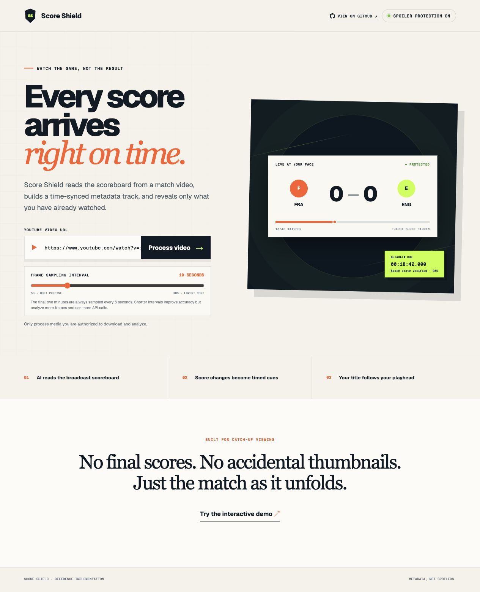

# Score Shield

> Built for **OpenAI Build Week, 13–21 July 2026**.


Score Shield is a Node.js and React reference implementation for spoiler-free sports playback. It downloads an authorized YouTube video, samples timestamped frames, uses AI to read the broadcast scoreboard, reconciles those observations into a reliable score timeline, and exports a WebVTT metadata track. The player uses the metadata to show only the score at the viewer's current playhead.

The hosted interface and interactive demo are available at [score-shield-sports.shazron.chatgpt.site](https://score-shield-sports.shazron.chatgpt.site). Real video processing runs locally because it requires FFmpeg, `yt-dlp`, filesystem access, and an OpenAI API key.

## Website preview

[](https://score-shield-sports.shazron.chatgpt.site)

## Why?

Watching a recorded match should still feel live. Fans often avoid news, social media, and messages until they have time to watch, only to have the result revealed by the streaming page itself. A title such as `England vs France 6–4 — World Cup 2026` gives away the final score before the viewer presses play. Even a title that only names the winner can remove most of the suspense.

The problem also affects games watched across multiple sessions. Streaming services such as YouTube can remember the playhead and resume a video where the viewer stopped. If someone pauses at halftime and returns later, the platform may put them back at the correct moment while still surrounding the player with a title, thumbnail, description, or recommendation based on the completed match. The playback position is preserved, but the viewing experience has already been spoiled.

Score Shield treats the title as part of the playback experience instead of permanent text. The generated metadata track records how the score changes over time, allowing the interface to show only what was known at the viewer's current position. Starting from the beginning shows the opening score; resuming midway shows the score at that moment; seeking backward restores an earlier state; and seeking forward updates only after the destination is reached. Dynamic titles are marked `(in progress)` until playback actually ends, when the title changes to `(final)`.

This approach gives streaming providers a practical way to preserve suspense without maintaining a separate spoiler-free edit of every game. The original video stays unchanged, while a small sidecar or embedded metadata track controls spoiler-safe titles, score displays, chapter labels, and future highlight experiences.

## Access the preview directly

Open the public preview in any modern browser:

**[Open the Score Shield interactive preview](https://score-shield-sports.shazron.chatgpt.site/preview)**

No ChatGPT login is required, so the link can be shared directly with demo viewers. The `/preview` route automatically runs the built-in FRA vs ENG demonstration and shows the protected title and score updating as playback advances. The main project landing page remains available at [score-shield-sports.shazron.chatgpt.site](https://score-shield-sports.shazron.chatgpt.site).

The hosted preview uses public demonstration data and does not run the video-processing worker. To analyze a YouTube video and generate a new score timeline, follow [Prepare a development machine](#prepare-a-development-machine), [Configure AI analysis](#configure-ai-analysis), and [Run locally](#run-locally) below.

## How it works

```text
YouTube URL
  → authorized local download with yt-dlp
  → FFprobe media inspection
  → timestamped frame sampling with FFmpeg
  → scoreboard reading with an OpenAI vision model
  → deterministic score-state reconciliation
  → manifest.json and score.vtt
  → React player synchronized to the current playhead
```

The AI produces candidate observations. Deterministic application code decides which observations become confirmed score states, rejects likely regressions and replay graphics, and builds contiguous WebVTT cues.

## Prerequisite

Install Node.js 22.13 or newer from the [official Node.js download page](https://nodejs.org/en/download). Choose an LTS release unless you have a reason to use the current release. The Node.js installer includes `npm`, so there is no separate npm download.

After installation, open a new terminal and verify both commands are available:

```bash
node --version
npm --version
```

The setup command below can install the remaining project and media dependencies, but it cannot install Node.js because `npm` itself requires Node. For version-manager and platform-specific options, see npm's official [Node.js and npm installation guide](https://docs.npmjs.com/downloading-and-installing-node-js-and-npm/).

## Prepare a development machine

Run:

```bash
npm run setup
```

This command:

- verifies the Node.js version;
- installs npm packages;
- detects and installs FFmpeg, FFprobe, and `yt-dlp` when missing;
- creates `.env` from `.env.example` without overwriting an existing file; and
- verifies that the required media commands are on `PATH`.

Supported package managers:

| Platform | Package managers |
| --- | --- |
| macOS | Homebrew |
| Linux | Homebrew, apt, dnf, pacman |
| Windows | Winget, Chocolatey |

Linux system package installation may request `sudo`. On Windows, restart the terminal after installation if newly installed commands are not immediately visible on `PATH`.

Useful preparation modes:

```bash
npm run setup:check              # Verify without installing anything
node scripts/setup.mjs --dry-run # Show the commands without running them
```

## Configure AI analysis

After setup, add an API key to `.env`:

```dotenv
OPENAI_API_KEY=your_key_here
```

Available configuration:

| Variable | Default | Purpose |
| --- | --- | --- |
| `OPENAI_API_KEY` | none | Required for real scoreboard analysis |
| `OPENAI_MODEL` | `gpt-5.6` | Vision-capable model used for frame analysis |
| `FRAME_INTERVAL_SECONDS` | `10` | Default sampling interval when an API request omits it; must be 5–30 seconds |
| `PROCESSOR_PORT` | `8787` | Local processing API port |
| `NEXT_PUBLIC_PROCESSOR_URL` | `http://localhost:8787` | Processor URL used by the React interface |
| `YTDLP_PATH` | `yt-dlp` on `PATH` | Optional executable override |
| `FFMPEG_PATH` | `ffmpeg` on `PATH` | Optional executable override |
| `FFPROBE_PATH` | `ffprobe` on `PATH` | Optional executable override |

Never commit `.env` or expose an API key in browser code.

The local processor validates `OPENAI_API_KEY` during startup. If the key is missing or blank, `npm run processor` and the combined `npm run dev` command exit immediately with instructions to add the key to `.env`; no job is accepted and no video is downloaded. The hosted interactive demo remains available because it does not start the local processor or make API calls.

## Run locally

Start the web app and processing API together:

```bash
npm run dev
```

- React interface: `http://localhost:3000`
- Processing API: `http://localhost:8787`
- Health check: `http://localhost:8787/health`

The UI is prefilled with this public test source:

```text
https://www.youtube.com/watch?v=jIrmswHtg9E
```

Only download and analyze media you are authorized to process. If the processor or API key is unavailable, choose **Preview the experience** to exercise the progress and protected-player flows without downloading the video or making model calls.

Before processing, choose a frame sampling interval from 5 to 30 seconds in whole-second steps. The final two minutes are always sampled every 5 seconds, regardless of the selected interval. This wider closing window accounts for stoppage time, celebrations, and outro footage that can place the last goal more than one minute before the media ends. Longer selections still reduce the number of frames and AI calls during the rest of the video. The UI selection overrides `FRAME_INTERVAL_SECONDS` for that job.

Downloaded YouTube media is cached by video URL under `artifacts/cache/youtube/`. Processing the same video again—including an equivalent `youtu.be` link—reuses the cached source instead of contacting YouTube. Frames, AI observations, and metadata are still regenerated for each job so configuration and pipeline changes take effect.

The terminal running `npm run dev` prints timestamped JSON logs for each local processing job. These include source-cache hits and misses, `yt-dlp` download progress, FFprobe inspection, FFmpeg frame extraction, AI frame counts, reconciliation, artifact export, completion, and failures. Logs intentionally omit API keys, model responses, detected scores, and the source video's title.

## Use the local Worker debugger

During `npm run dev`, Vite may print two web addresses:

```text
Local:  http://localhost:3000/
Debug:  http://localhost:3000/__debug
```

The **Local** address is the Score Shield interface. The optional **Debug** address is supplied by the Cloudflare development plugin; it redirects to Cloudflare DevTools and connects that debugger to the locally emulated Worker. It is not another Score Shield page.

To try it:

1. Keep `npm run dev` running and open `http://localhost:3000` in one tab.
2. Open `http://localhost:3000/__debug` in a second tab. It should redirect to a DevTools interface. If the browser blocks extra tabs, allow pop-ups for localhost; the plugin may open one debugger tab per Worker.
3. Select **Sources**, press <kbd>Command</kbd>+<kbd>P</kbd> on macOS or <kbd>Ctrl</kbd>+<kbd>P</kbd> on Windows/Linux, and search for `worker/index.ts`.
4. Set a breakpoint inside the Worker's `fetch` function, then reload the normal Score Shield tab. DevTools should pause when the Worker receives the request.
5. Use **Console** for Worker-side logs and **Network** to inspect requests handled by the Worker. Remove or disable the breakpoint when finished.

This debugger covers the Cloudflare Worker and server-rendering path used by the React site. It does **not** debug browser-side React code or the local media processor:

- For React interactions, use the normal browser developer tools on the `localhost:3000` tab.
- For downloads, FFmpeg, AI analysis, and the API on port `8787`, use the terminal output from `npm run dev` or `npm run processor`.

The `__debug` route exists only in the local development/preview server and is not a deployed product route. Do not expose the local development server publicly while the inspector is enabled.

## Processing progress

The processor reports structured progress through Server-Sent Events:

```text
downloading → extracting → analyzing → reconciling → exporting → complete
```

The React interface displays the active stage, stage percentage, overall percentage, elapsed time, estimated remaining time when available, and analyzed frame counts. A cache hit completes the download stage immediately. A failed job remains visible with a useful error instead of silently disappearing. After a successful local run, the player provides a **Download .vtt** link for the generated metadata track.

## API

| Method | Endpoint | Purpose |
| --- | --- | --- |
| `GET` | `/health` | Processor health check |
| `POST` | `/api/jobs` | Start a job with `{ "sourceUrl": "https://…", "frameIntervalSeconds": 5 }` |
| `GET` | `/api/jobs/:id` | Get a job snapshot |
| `GET` | `/api/jobs/:id/events` | Stream progress using Server-Sent Events |
| `GET` | `/api/jobs/:id/manifest` | Download the completed JSON timeline |
| `GET` | `/api/jobs/:id/score.vtt` | Download the WebVTT metadata track |

The API accepts HTTPS YouTube and `youtu.be` URLs only. `frameIntervalSeconds` is optional for direct API clients, but when provided it must be a whole number from 5 through 30. Jobs are currently stored in memory, so processor restarts discard job status while generated files remain on disk.

## Generated artifacts

Each job writes to `artifacts/<job-id>/`:

| Artifact | Description |
| --- | --- |
| `frames/` | Timestamped frames sent for analysis |
| `observations.json` | Raw, validated AI observations |
| `manifest.json` | Reconciled score timeline, evidence references, selected interval, and high-frequency closing-window settings |
| `score.vtt` | Time-aligned score metadata track |

Source media is stored once at `artifacts/cache/youtube/<url-hash>/source.*`. The `artifacts/` directory is ignored by Git and may contain large or copyrighted media. Remove individual job directories when their generated files are no longer needed. Remove `artifacts/cache/youtube/` when cached source videos are no longer needed; the PoC does not currently evict them automatically.

To remove every completed run's frames, observations, manifest, and VTT while preserving the downloaded YouTube cache, stop the processor and run:

```bash
npm run artifacts:clean
```

The command is implemented in Node.js and works on macOS, Linux, and Windows. It respects `ARTIFACTS_DIR` when configured and deletes only UUID-named job directories directly beneath that artifacts root; `cache/` and unrelated directories are left intact.

## Project structure

```text
app/                    React interface and styling
server/index.mjs        Local HTTP API and SSE job progress
server/config.mjs       Sampling defaults, validation, and closing-window plan
server/pipeline.mjs     Download, sampling, AI analysis, reconciliation, export
server/startup.mjs      Processor environment validation
scripts/clean-artifacts.mjs Cross-platform job-artifact cleanup
scripts/dev.mjs         Starts the web app and processor together
scripts/setup.mjs       Cross-platform dependency preparation
tests/                  Pipeline, startup, cleanup, setup, and rendered-page tests
public/                 Static assets and social preview
.openai/hosting.json    Hosted demo configuration
```

## Commands

```bash
npm run setup        # Install and verify local dependencies
npm run setup:check  # Verify dependencies without changing anything
npm run dev          # Start the web app and processor
npm run dev:web      # Start only the React web app
npm run processor    # Start only the local processing API
npm run artifacts:clean # Delete job artifacts while preserving video cache
npm run test:unit    # Run pipeline, startup, cleanup, and setup tests
npm test             # Run unit tests, production build, and rendered-page test
npm run lint         # Run ESLint
npm run build        # Build the hosted React experience
npm run wiki:init    # Generate the initial OpenWiki repository documentation
npm run wiki:update  # Refresh OpenWiki documentation non-interactively
```

## OpenWiki documentation

[OpenWiki](https://github.com/langchain-ai/openwiki) can generate agent-oriented repository documentation under `openwiki/`. Install the pinned CLI version, ensure `OPENAI_API_KEY` is configured in `.env`, and then generate the first version locally:

```bash
npm install --global openwiki@0.2.0
npm run wiki:init
```

The workflow at `.github/workflows/openwiki-update.yml` runs daily and can also be started manually from the GitHub Actions tab. It refreshes the wiki and opens or updates a `docs: update OpenWiki` pull request rather than writing directly to the default branch.

Before running the workflow, add `OPENAI_API_KEY` as a GitHub Actions repository secret under **Settings → Secrets and variables → Actions**. Under **Settings → Actions → General → Workflow permissions**, also allow GitHub Actions to create pull requests. The workflow uses OpenAI with `gpt-5.6-terra`; change `OPENWIKI_PROVIDER`, `OPENWIKI_MODEL_ID`, and the corresponding secret if another [supported provider](https://github.com/langchain-ai/openwiki#customizing) is preferred. CI telemetry is disabled in the checked-in workflow.

## Challenges

1. **The embedded YouTube title can still reveal the result.** Score Shield controls its surrounding React interface and dynamic title, but YouTube owns the contents of its iframe. YouTube may display the video's original title inside the player during loading, pausing, hovering, or playback, and that title may contain the final score.
2. **Playing the downloaded MP4 ourselves would avoid that provider overlay.** A native HTML video player could use the cached, authorized source copy and give Score Shield full control over every visible title and control surface. Implementing secure media serving, byte-range seeking, and the corresponding playback UI is left as a later exercise.
3. **Embedding the WebVTT as a metadata track would make the result more portable.** The reference implementation currently emits `score.vtt` as a sidecar file that the interface can download and consume alongside the video. Muxing it into the media container would allow the score timeline to travel with the video itself. Browsers do not currently provide dependable native access to this kind of embedded MP4 metadata track, so the Score Shield UI would also need to extract or demux the track and read its cues directly in JavaScript. Both the embedding step and that JavaScript reader are left as a later exercise.

## Current limitations

- The PoC targets scoreboard-based sports broadcasts and is not yet sport-specific.
- The default sampling interval is 10 seconds, with a 5-second override during the final two minutes; brief scoreboard states can still fall between sampled frames.
- The first implementation analyzes sampled frames sequentially and does not yet cache unchanged scoreboard crops.
- A YouTube iframe may display provider-owned title or thumbnail UI that the surrounding page cannot fully control. The player covers the iframe until the viewer chooses to begin.
- Local job state is not durable across processor restarts.
- Cached source videos do not currently have an automatic size limit or expiration policy.
- The hosted site demonstrates the interface; it does not host the FFmpeg processing worker.

## Development guidelines

Read [`AGENTS.md`](AGENTS.md) before changing the project. At minimum, run `npm run test:unit` and `npm run lint` for logic changes. Run `npm test` before handing off changes that affect the player, build configuration, metadata, or deployment output.

## Responsible use

Score Shield is a reference implementation, not a mechanism for bypassing media access controls. Process only videos you own or are authorized to download and analyze, respect the source platform's terms, and do not redistribute downloaded source media.

## License

Licensed under the [Apache License 2.0](LICENSE).
